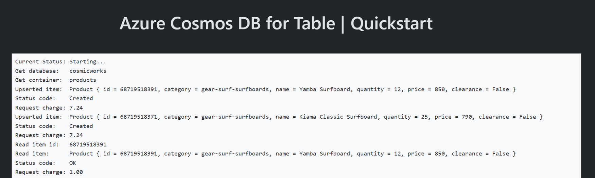

# Quickstart: Azure Cosmos DB for Table - Azure SDK for Node.js

This is a simple Express web application to illustrate common basic usage of Azure Cosmos DB for Table with the Azure SDK for Node.js.

### Prerequisites

- [Docker](https://www.docker.com/)
- [Azure Developer CLI](https://aka.ms/azd-install)
- [Node.js 22 or newer](https://nodejs.org/)

### Quickstart

1. Log in to Azure Developer CLI.

    ```bash
    azd auth login
    ```

    > [!TIP]
    > This is only required once per-install.

1. Initialize this template (`cosmos-db-table-nodejs-quickstart`) using `azd init`

    ```bash
    azd init --template cosmos-db-table-nodejs-quickstart
    ```

1. Ensure that **Docker** is running in your environment.

1. Use `azd up` to provision your Azure infrastructure and deploy the web application to Azure.

    ```bash
    azd up
    ```

1. Observed the deployed web application

    

1. (Optionally) Run this web application locally in either the `src/js` or `src/ts` folders:

    ```bash
    npm install
    npm run dev
    ```

    > [!IMPORTANT]
    > When your Azure infrastructure is provisioned, the endpoint for your deployed Azure Cosmos DB for NoSQL account is automatically saved in the *.env* file for both the JavaScript and TypeScript local projects to make debugging easier.